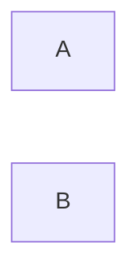

Sono macchine con un insieme finito di stati:
{Acceso, Spento}, {1,2,3,4,...,k}, {on,off}

Che si possono cosí rappresentare:

Sono real time, lavorano solo sullo stato in cui sono e sullo stato in ingresso

[[Automa a pila]]
