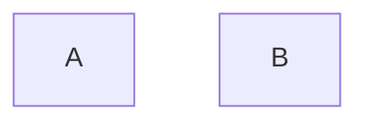

Sono macchine con un insieme finito di stati:
{Acceso, Spento}, {1,2,3,4,...,k}, {on,off}

Che si possono cosí rappresentare:



>[!multi-column]
>
>>[!esempio]
>>```mermaid
>>graph LR
>> On -->|T| Off -->|T| On
>> 
>>
>>```
>
>>[!esempio]
>>```mermaid
>>graph LR
>>	On -->|R| Off -->|S| On
>>	On -->|s| On
>>	Off -->|R| Off
>>```


Quindi un automa a stato finito è costituito da:
- un insieme finito di stati $Q = \left\{ q_{1},q_{2},\dots,q_{n} \right\}$
- un insieme finito ([[Linguaggio|alfabeto]]) di ingressi 
- una [[funzione di transizione]] (parziale) $\gamma:Q \times I \to Q$

Sono real time, lavorano solo sullo stato in cui sono e sullo stato in ingresso

[[Automa a pila]]
